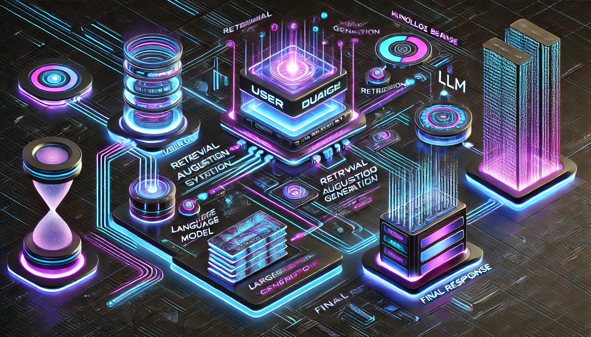

# RAG Optimization Experiments on the SQuAD Dataset

## 📌 Project Overview

This repository contains a series of **Retrieval-Augmented Generation (RAG)** optimization experiments conducted for learning and research purposes.

The focus is on improving retrieval quality and generation performance using the [SQuAD dataset](https://rajpurkar.github.io/SQuAD-explorer/) (Stanford Question Answering Dataset).

To overcome CPU limitations and the lack of GPUs, I  explored using [Replicate](https://replicate.com) to run the experiments on the cloud, which allowed for efficient execution of large language models. Replicate is user-friendly and simplifies running large language models. While it is a paid service, the cost of running some simple experiments is limited.

To provide an interactive experience with my optimized RAG models, I have developed a **Streamlit application** that allows users to engage directly with the RAG-based chatbot. 

The Streamlit app has been deployed to allow easy access for users to interact with the RAG-based system. The application has been hosted on Streamlit’s cloud platform, which simplifies the deployment process and provides a smooth user experience. You can access the deployed app [here](https://rag-optimization-ohtsg2ab2bdgogytojogyb.streamlit.app/). 

As this project is still in progress, there may be occasional performance inconsistencies. However, I'm actively working on fine-tuning the system for a more optimized and seamless user experience.

## 🎯 Objectives

The primary goal of these experiments is to understand how to optimize effectively the various components of a RAG pipeline, including retrieval quality, embeddings, and response generation.

The experiments in this repository explore:

- Optimizing RAG architectures to enhance information retrieval.
- Evaluating different embedding models and vector database configurations.
- Optimizing the retrieval process to improve answer accuracy.
- Testing various chunking strategies for document preprocessing.

## 🛠️ Tech Stack

- Python (3.12+ recommended)
- LangChain
- HuggingFace
- OpenAI
- Streamlit
- Replicate

## 🔄 Status

Project is: In Progress

#

📝 Author: Maria Dancianu

📅 Last Updated: March 2025
